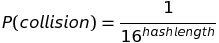

# dtwp

#### What? 

dtwp stands for "dont type wrong please". It is a python library that attempts to solve the problem of people making typing mistakes on code input. The library provides tools to create codes with a trailing hash of various length and to check if inputted code is correct.

#### Installation

    git clone https://github.com/juissi999/dtwp.git

#### Usage

dtwp does not use class-structure. It is a simple import module on python 3.
A few lines of example code:

    import dtwp
    
    codelist = dtwp.createcodes(start_integer, end_integer, hash_length)
    print(codelist)
    
    is_code_correct = dtwp.check_code(codestring, hash_length)
    print(is_code_correct)

#### Mathematical background

The nature of a hash is that it is not a bijection so many different codes share a same hash. This method can never take out 100% of the typing errors, but it should make the probability much lower.

The most common typing errors are

- mistyped letter on code or hash
- missing letter on either code or hash
- extra letter on either code or hash

The hash_length parameter defines how many hex-values are taken from the beginning of the hash. Making the hash_length larger decreases the collisions of coding errors and thus makes the method work better.

A raw calculation of collision probability assuming hash-function provides a random distribution would be

This is not a deep-analysis of all of the error-types but a simple estimation of how probable it is to find a match of a mistyped code/hash pair.

#### Tests

You can test the success rate of the method with a test. The test should cover most basic mistakes on code typing covered in Mathematical background-section.

Run tests by typing:

    python test.py